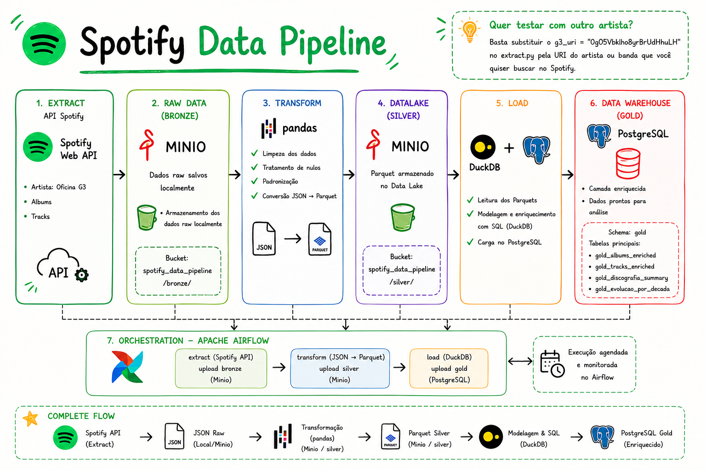

Pipeline de dados completo que extrai informações da API do Spotify sobre a banda **Oficina G3**, processa e armazena os dados em um datalake local, transforma em arquivos Parquet e carrega em um banco de dados PostgreSQL — tudo orquestrado com Airflow e rodando localmente via Docker. Os dados enriquecidos são explorados através de um **dashboard interativo em Streamlit**.

> 💡 Quer testar com outro artista? Basta substituir o `g3_uri = "0gO5Vbklho8yrBrUdHhuLH"` no extract.py pela URI do artista ou banda que você quiser buscar no Spotify.

Este é um projeto de estudo desenvolvido com o objetivo de aprender na prática, construindo um pipeline ETL real do zero. A ideia do projeto foi buscar dados da API do Spotify, passar por todas as camadas de um pipeline moderno - da extração bruta até o dado enriquecido e pronto para consulta, entender como cada ferramenta funciona dentro desse processo, tentando fazer tudo com o minimo de ajuda de IA possivel, apenas em momentos em que não enxerguei outra saida.

---

## App streamlit


---

## Como Rodar o Projeto

### Pré-requisitos

- [Docker](https://www.docker.com/) instalado
- [DBeaver](https://dbeaver.io/download/) instalado (opcional, útil para explorar o banco além do dashboard)
- Credenciais da [API do Spotify](https://developer.spotify.com/dashboard) (Client ID e Client Secret)

### 1. Clone o repositório

```bash
git clone https://github.com/MIGUELEDL/spotify_data_pipeline.git
cd spotify_data_pipeline
```

### 2. Instale o UV

O projeto utiliza **UV** como gerenciador de dependências.

### Windows

```powershell
powershell -ExecutionPolicy ByPass -c "irm https://astral.sh/uv/install.ps1 | iex"
```

### Linux / macOS

```bash
curl -LsSf https://astral.sh/uv/install.sh | sh
```

Verifique a instalação:

```bash
uv --version
```

### 3. Instale todas as dependências do projeto

Dentro da pasta do projeto execute:

```bash
uv sync
```

ou, caso utilize o arquivo `uv.lock`:

```bash
uv sync --frozen
```

Esse comando instalará automaticamente todas as bibliotecas necessárias para executar o projeto localmente.

### 4. Crie a estrutura de pastas locais

Essas pastas são geradas em runtime e não estão no repositório (`.gitignore`).
Crie-as antes de subir os serviços:

### Linux / macOS

```bash
mkdir -p data/minio_data \
         data/postgres_data \
```

### Windows (PowerShell)

```powershell
New-Item -ItemType Directory -Force -Path `
data/minio_data, `
data/postgres_data,
```

### 5. Configure as variáveis de ambiente

Crie um arquivo `.env` na raiz do projeto e configure as variáveis abaixo de acordo com o seu ambiente.

```env

# APACHE AIRFLOW
AIRFLOW_IMAGE_NAME=apache/airflow:2.9.2
_AIRFLOW_WWW_USER_USERNAME=admin
_AIRFLOW_WWW_USER_PASSWORD=admin

# Diretórios locais montados nos containers do Airflow
AIRFLOW_DAGS=./dags
AIRFLOW_PLUGINS=./plugins

# MINIO
MINIO_ENDPOINT=http://minio:9000
MINIO_ROOT_USER=admin
MINIO_ROOT_PASSWORD=admin123
BUCKET_NAME=spotify-data-pipeline

# SPOTIFY API
APP_CLIENT_ID=SEU_CLIENT_ID
APP_CLIENT_SECRET=SEU_CLIENT_SECRET

# POSTGRESQL
POSTGRES_HOST=postgres
POSTGRES_PORT=5432
POSTGRES_USER=airflow
POSTGRES_PASSWORD=airflow
POSTGRES_DB=airflow
```

> **Observações importantes**
>
> - Substitua `SEU_CLIENT_ID` e `SEU_CLIENT_SECRET` pelas credenciais obtidas no **Spotify Developer Dashboard**.
> - O nome do bucket (`spotify-data-pipeline`) deve ser exatamente igual ao definido na variável `BUCKET_NAME`.
> - Caso altere o usuário ou a senha do MinIO ou do PostgreSQL, atualize os mesmos valores no arquivo `.env` antes de iniciar os containers.
> - O usuário e a senha do Airflow (`admin`/`admin`) podem ser alterados conforme sua preferência.
> - Os logs do Apache Airflow são armazenados automaticamente em um volume Docker (airflow_logs). Isso evita problemas de permissões entre Windows, Linux e macOS, dispensando a criação manual da pasta de logs.

### 6. Suba os serviços com Docker

```bash
docker compose up --build -d
```

Esse comando irá iniciar automaticamente:

- PostgreSQL
- MinIO
- Apache Airflow
- Streamlit

Verifique se todos os containers estão em execução:

```bash
docker compose ps
```

### 7. Acesse o Airflow

Abra:

```
http://localhost:8080
```

Login padrão:

```
Usuário: admin
Senha: admin
```

### 8. Execute o pipeline

#### Execute a DAG

No Airflow:

1. Ative a DAG **spotify_data_pipeline**;
2. Clique em **Trigger DAG**;
3. Aguarde a conclusão do pipeline.

### 9. Verifique os dados

### MinIO

Após a execução da DAG deverão existir as seguintes camadas:

```
bronze/
silver/
```
---

### 10. Abra o Dashboard

Acesse:

```
http://localhost:8501
```

O dashboard exibirá automaticamente os dados processados da camada Gold.

### 🔄 Executar novamente o pipeline

Sempre que desejar atualizar os dados basta executar novamente a DAG no Airflow.

Os novos arquivos serão gravados na Bronze e Silver, e as tabelas da camada Gold serão atualizadas automaticamente.

### ⚠️ Problemas comuns

### O bucket não existe

Crie manualmente o bucket:

```
spotify-data-pipeline
```

### A DAG não aparece

Reinicie os containers do Airflow:

```bash
docker compose restart airflow-webserver airflow-scheduler
```

### O Streamlit não abre

Verifique os logs:

```bash
docker logs streamlit
```

Caso necessário:

```bash
docker compose restart streamlit
```

### Algum container não iniciou

Verifique:

```bash
docker compose ps
```

e os logs:

```bash
docker compose logs
```

---

## Stack Utilizada:
| Ferramenta | Função |
|---|---|
| **Python** | Linguagem principal do pipeline |
| **Pandas** | Transformação e manipulação dos dados |
| **DuckDB** | Consultas SQL sobre os dados transformados |
| **Apache Airflow** | Orquestração e agendamento das DAGs |
| **MinIO** | Data Lake local (armazenamento de JSONs e Parquets) |
| **PostgreSQL** | Banco de dados para carga final dos dados |
| **Streamlit** | Dashboard interativo de visualização da camada gold |
| **Docker / Docker Compose** | Containerização de toda a infraestrutura |
| **SQL** | Enriquecimento e modelagem dos dados |

---

## Estrutura do Projeto

```
spotify_data_pipeline/
│
├── app/                          # Dashboard Streamlit
│   ├── pages/                    # Páginas do dashboard (Álbuns, Faixas, Rankings, Evolução)
│   ├── utils/                    # Cache de queries (db.py) e estilo/formatação (style.py)
│   └── app.py                    # Página inicial (Visão Geral)
│
├── dags/
│   └── spotify_dag_pipeline.py   # DAG principal do Airflow
│
├── data/                         # Dados gerados localmente (gitignore)
│   ├── minio_data/               # Dados persistidos do MinIO
│   ├── postgres_data/            # Dados persistidos do PostgreSQL
│
├── scripts/                       # Core da lógica ETL e Notebooks de teste
│   ├── extract.py / .ipynb        # Extração da API Spotify -> JSON
│   ├── transform.py / .ipynb      # Limpeza e conversão JSON -> Parquet
│   ├── load.py / .ipynb           # Carga dos dados no PostgreSQL
│   └── init_gold_schema.sql       # Script de inicialização do banco
│
├── sql/
│   └── gold/                     # Queries SQL da camada enriquecida
│       ├── gold_albums_enriched.sql
│       ├── gold_discografia_summary.sql
│       ├── gold_evolucao_por_decada.sql
│       └── gold_tracks_enriched.sql
│
├── utils/
│   ├── minio_client.py           # Cliente de conexão com o MinIO
│   └── postgres_client.py        # Cliente de conexão com o PostgreSQL
│
├── .dockerignore
├── .env                          # Variáveis de ambiente
├── .gitignore
├── .python-version
├── docker-compose.yaml           # Orquestração dos serviços
├── Dockerfile                    # Imagem Docker customizada
├── pyproject.toml                # Dependências do projeto
├── uv.lock                       # Lock file do gerenciador uv
└── README.md
```

---

## O que Estou Aprendendo

Este projeto foi desenvolvido como parte da minha jornada de aprendizado em Engenharia de Dados. Cada ferramenta foi estudada e integrada com intenção, lendo documentações, entendendo como as libs funcionam por baixo dos panos e construindo a base antes de avançar para as etapas seguintes.

Algumas das habilidades praticadas:

- Consumo de APIs REST e autenticação OAuth2
- Armazenamento de dados brutos em formato JSON em um Data Lake
- Transformação de dados com Pandas e consultas com DuckDB
- Persistência em formato Parquet para otimização de leitura
- Modelagem e carga de dados em PostgreSQL
- Criação e orquestração de DAGs no Apache Airflow
- Construção de um dashboard interativo com Streamlit
- Containerização de toda a infraestrutura com Docker

---

## Autor

**Miguel Ernandes Dias Lucena**
Aspirante a Engenheiro de Dados | Caicó, RN

[](https://www.linkedin.com/in/miguel-ernandes-6b07b72a2/)
[](https://substack.com/@migueledl)
[](mailto:miguelernandes2812@gmail.com)
[](https://www.instagram.com/miguelernandees/)

---

> *"Antes de manipular dados, você precisa entendê-los."*
